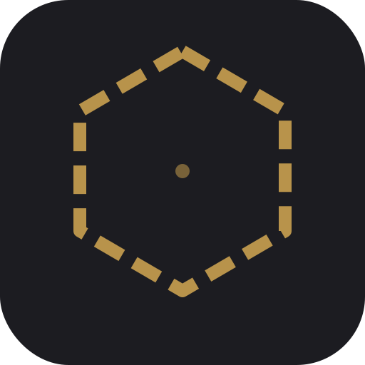

<p align="center"></p>

# r2-hive

<p align="center">
Your own connectivity, on your own terms.<br>
Part of <a href="https://reality2-ai.github.io">Reality2</a>.
</p>

**r2-hive** is the R2 software stack for general-purpose hosts — a
Linux/macOS/Windows daemon. Any device running the R2 stack is a
**hive**. A hive deployed as a public connectivity point — one that
forwards encrypted frames between devices in the same trust group,
across the internet — is a **wayfinder** (the role formerly called a
*relay*).

**A wayfinder never reads your data.** It forwards sealed, encrypted
frames between devices that share a trust group — like a postal service
carrying sealed envelopes: it knows where to deliver them, but not
what's inside. r2-hive operates at the routing layers only and never
decrypts payloads.

Beyond forwarding, a hive can join trust groups over a multi-transport
mesh (WebSocket, UDP-LAN, BLE, LoRa), run sentant ensembles with
OTP-style supervision, and serve web plugins over HTTPS / WebSocket.

## Use the community wayfinder

A public wayfinder is available for anyone:

```
wss://relay.reality2.ai/r2
```

It's untrusted by design — it forwards encrypted bytes and cannot read
your data. Use it to get started without running your own; for example,
in [Notekeeper](https://github.com/reality2-ai/r2-notekeeper) enter it
as the relay URL in Settings. Switch to your own wayfinder any time.

## Run your own wayfinder

You need a wayfinder reachable on the internet if your devices should
find each other when they're on different networks (e.g. a laptop at
home and a phone on mobile data). On a single local network you don't
need one.

### Build

The R2 protocol crates come from **r2-core**, pinned to an exact git
revision in `Cargo.toml`, so a normal build fetches them automatically —
you only need read access to the (private) r2-core repository:

```sh
git clone https://github.com/reality2-ai/r2-hive.git
cd r2-hive
cargo build --release
./target/release/r2-hive --auto
```

To build against a **local** r2-core instead (offline, or co-editing
both repos), clone it as a sibling and uncomment the `[patch]` block at
the bottom of `Cargo.toml` to redirect the git deps at `../r2-core` —
local only, never commit the patch.

(Releases will pin to published crates.io versions; until then the
git-pinned r2-core revision is the source of the protocol crates.)

### Deploy to a VPS (automatic HTTPS)

For an always-on wayfinder with a domain and TLS:

```sh
./deploy.sh admin@your-server wayfinder.yourdomain.com
```

This builds the binary, copies it to your server, installs
[Caddy](https://caddyserver.com) for automatic Let's Encrypt TLS, and
sets up a systemd service. Your wayfinder will be reachable at
`wss://wayfinder.yourdomain.com/r2`. Requirements: a VPS with a public
IP and a domain pointing to it. Run it from a full r2-hive checkout with
access to r2-core (it builds the binary locally before shipping it).

### Run locally without a service

```sh
cargo run --release -- --auto
```

### Docker

A `Dockerfile` is included. It builds from a parent directory that holds
both `r2-hive/` and `r2-core/` side by side; the image build activates the
Cargo `[patch]` block so it compiles against the COPY-ed local r2-core
(offline — no r2-core git credentials needed). See the comments in the file.

### Checking it works

Open `http://127.0.0.1:21042` on the host — you'll see the wayfinder
dashboard: a live view of connections, trust groups, and frames being
routed. Public listeners require `--allow-public-bind`; put TLS in
front before exposing one.

## Options

```
r2-hive [OPTIONS]
  --port <PORT>           Port for WebSocket + HTTP   [default: 21042]
  --bind <ADDR>           Bind address                [default: 127.0.0.1]
  --allow-public-bind     Permit a non-loopback listener
  --buffer-size <N>       Recent frames kept per trust group [default: 1000]
  --max-connections <N>   Max simultaneous connections [default: 10000]
  --auto                  Auto-detect transports at startup
  --lan | --ble | --lora  Enable additional transports
  --no-usb                Disable the USB-peripheral watcher (servers)
```

Run `r2-hive --help` for the full list. Settings can also come from
`$XDG_CONFIG_HOME/r2/hive.toml`; see
[`crates/r2-hive-bin/packaging/defaults/hive.toml`](crates/r2-hive-bin/packaging/defaults/hive.toml).
CLI flags override the file.

The management WebSocket `/r2/mgmt` is mounted only on loopback listeners
and requires browser-session auth. On public binds, use the local Unix
management socket for control.

## How a wayfinder works

When a device connects, it names its trust group and nothing else — the
subscribe is **auth-free**. The wayfinder records no device identity
(only an ephemeral per-connection handle) and holds no trust-group
secret, so it authenticates nothing and has nothing to leak. It places
the connection in a bucket with every other device in the same trust
group and forwards frames between them. Trust is **end-to-end**: frames
are sealed and HMAC-signed with the trust-group key and checked at the
member devices (the deliver-gate), never at the wayfinder. (An earlier
Ed25519 device-to-relay handshake was removed — it gated nothing the
end-to-end trust layer doesn't already cover, and a stable device id on
the wire broke the R2-WIRE device-id-off-air rule.)

- **Multiple trust groups** share one wayfinder without seeing each other.
- **Your data is encrypted** before it reaches the wayfinder — it can't read it.
- **If the wayfinder restarts**, devices reconnect within seconds; a
  per-group catchup buffer replays recent frames.
- **If it goes down**, devices still work locally — they just can't
  reach each other across the internet until it's back.

## Crates in this workspace

| Crate | Purpose |
|---|---|
| [`crates/r2-hive-bin`](crates/r2-hive-bin/) | The daemon — library + `r2-hive` binary |
| [`crates/r2hive-cli`](crates/r2hive-cli/) | `r2hive` operator CLI |

The repo also contains `crates/r2-hive-wasm` (browser/wasm platform
layer) and `crates/r2-wasm-host` (linkable-base wasm host); both are
**excluded from the default workspace** and built explicitly for their
own targets — see the comments in `Cargo.toml`.

## Documentation

- [`crates/r2-hive-bin/README.md`](crates/r2-hive-bin/README.md) — daemon overview
- [`crates/r2-hive-bin/docs/architecture.md`](crates/r2-hive-bin/docs/architecture.md) — module breakdown
- [`crates/r2-hive-bin/docs/mgmt-api.md`](crates/r2-hive-bin/docs/mgmt-api.md) — management-API reference
- [`crates/r2-hive-bin/DESIGN.md`](crates/r2-hive-bin/DESIGN.md) — design rationale
- [`crates/r2-hive-bin/TEST-RIG.md`](crates/r2-hive-bin/TEST-RIG.md) — hardware test rig

The normative protocol specs live in the `r2-specifications` repo.

## Related repositories

Reality2 is one dependency web. r2-hive sits at the application/daemon
layer of the spine:

**r2-specifications → r2-core → r2-hive** (+ peer apps) **→ devices, clients, docs**

**Upstream** — what r2-hive builds on:

- [r2-specifications](https://github.com/reality2-ai/r2-specifications) *(private)* — the normative protocol specs; the source of truth all R2 code derives from.
- [r2-core](https://github.com/reality2-ai/r2-core) *(private)* — the Rust implementation of the specs, and r2-hive's direct dependency: the `r2-wire`, `r2-route`, `r2-trust`, `r2-transport`, `r2-discovery`, `r2-engine`, `r2-def`, `r2-ensemble`, `r2-dispatch`, `r2-update`, and `r2-hive-core` crates are consumed git-pinned from here (see `Cargo.toml`).

**Alongside** — peer apps built on the same r2-core:

- [r2-composer](https://github.com/reality2-ai/r2-composer) — visual composer for Reality2 firmware.
- [r2-workshop](https://github.com/reality2-ai/r2-workshop) — wireless sensor mesh for workshop/lab.
- [r2-android](https://github.com/reality2-ai/r2-android) *(private)* — native mobile client.
- [bos](https://github.com/reality2-ai/bos) *(private)* — AI-native business operating system on R2.

**Downstream** — things that connect to a hive / wayfinder:

- [r2-notekeeper](https://github.com/reality2-ai/r2-notekeeper) — notes app that uses a wayfinder as its relay (see [Use the community wayfinder](#use-the-community-wayfinder)).
- [reality2-ai.github.io](https://github.com/reality2-ai/reality2-ai.github.io) — the Reality2 project site.

Related: [anthill](https://github.com/reality2-ai/anthill) and
[anthill-r2](https://github.com/reality2-ai/anthill-r2) *(private)* build
a separate agent colony on the same r2-specifications + r2-core.

## Status

Field-validated across x86_64 laptop (Ubuntu / Pop!_OS), Pi 5
(aarch64), and 2× Arduino UNO-Q (aarch64). The community wayfinder at
`relay.reality2.ai` runs this stack.

## License

Dual-licensed under MIT or Apache-2.0 — your choice. See
[`LICENSE-MIT`](LICENSE-MIT) and [`LICENSE-APACHE`](LICENSE-APACHE).
This is the open-core layer of Reality2: the protocol stack ships free;
the Mariko marketplace ships commercial.
